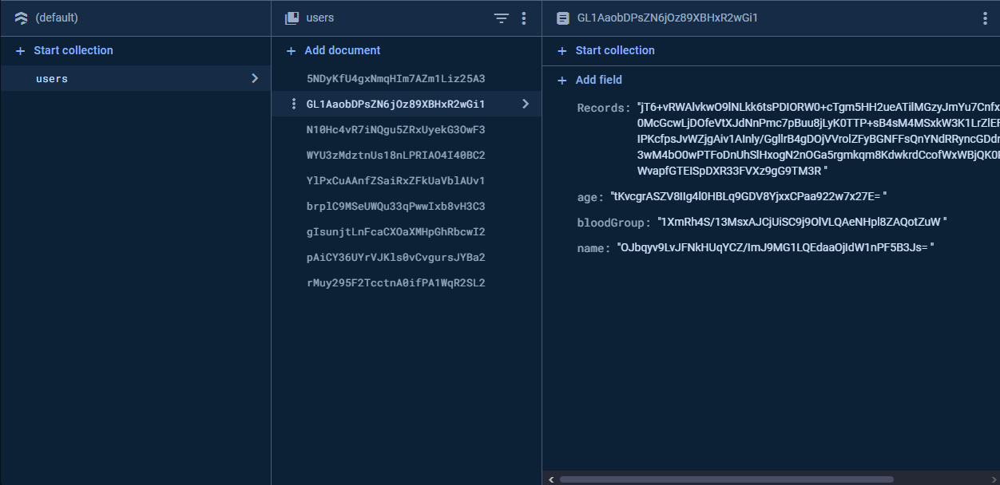

# OMEGA-37-SURVEY-CORPS

## Domain -  Healthcare And Fitness
(Exist in Master branch)
# Tell-a-Doc Patient App

Tell-a-Doc Patient App is an Android application designed to help patients securely manage and share their medical records with healthcare providers. The app allows users to store encrypted medical records, share them via QR codes, and access them from multiple devices.

## Features

- **User Authentication**: Secure user login using email and password with Firebase Authentication.
- **Medical Record Management**: Users can add, edit, and delete their medical records, including details such as disease name, type (Allergy or Disease), since, and description.
- **Data Encryption**: All user data is encrypted before being stored in Firebase Firestore to ensure privacy and security.
- **QR Code Sharing**: Users can generate a QR code to share their encrypted medical data with doctors or healthcare providers.
- **Cross-Device Sync**: Access medical records from multiple devices, with data synced securely through Firebase Firestore.

## Screenshots

## Install the apk

### Prerequisites

- Android Studio installed on your machine.
- A Firebase project set up with Authentication and Firestore enabled.

### Project Structure
MainActivity.java: Main entry point of the application.
LoginActivity.java: Handles user authentication.
MedicalRecordActivity.java: Allows users to add and view medical records.
ProfileActivity.java: Manages user profile information.
EncryptionUtils.java: Utility class for encrypting and decrypting user data.
FirestoreUtils.java: Helper class for interacting with Firebase Firestore.
